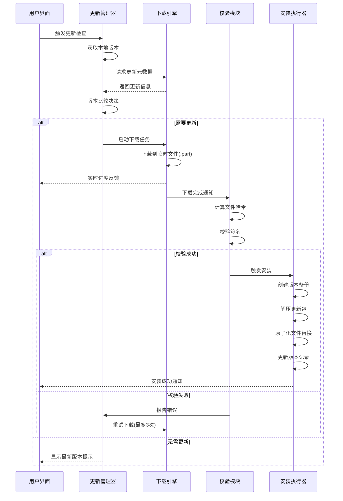

```mermaid
sequenceDiagram
    participant U as 用户界面
    participant M as 更新管理器
    participant D as 下载引擎
    participant V as 校验模块
    participant I as 安装执行器
    
    U->>M: 触发更新检查
    M->>M: 获取本地版本
    M->>D: 请求更新元数据
    D-->>M: 返回更新信息
    M->>M: 版本比较决策
    
    alt 需要更新
        M->>D: 启动下载任务
        D->>D: 下载到临时文件(.part)
        D-->>U: 实时进度反馈
        D->>V: 下载完成通知
        V->>V: 计算文件哈希
        V->>V: 校验签名
        alt 校验成功
            V->>I: 触发安装
            I->>I: 创建版本备份
            I->>I: 解压更新包
            I->>I: 原子化文件替换
            I->>I: 更新版本记录
            I-->>U: 安装成功通知
        else 校验失败
            V->>M: 报告错误
            M->>D: 重试下载(最多3次)
        end
    else 无需更新
        M-->>U: 显示最新版本提示
    end
```
