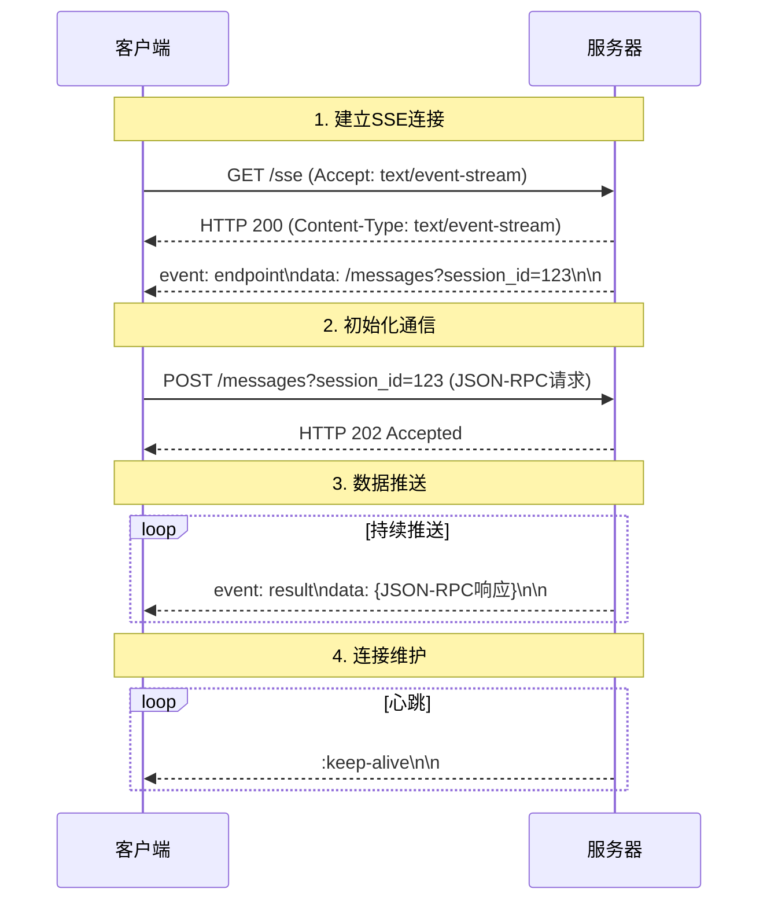

```mermaid
sequenceDiagram
    participant Client as 客户端
    participant Server as 服务器

    Note over Client,Server: 1. 建立SSE连接
    Client->>Server: GET /sse (Accept: text/event-stream)
    Server-->>Client: HTTP 200 (Content-Type: text/event-stream)
    Server-->>Client: event: endpoint\ndata: /messages?session_id=123\n\n

    Note over Client,Server: 2. 初始化通信
    Client->>Server: POST /messages?session_id=123 (JSON-RPC请求)
    Server-->>Client: HTTP 202 Accepted

    Note over Client,Server: 3. 数据推送
    loop 持续推送
        Server-->>Client: event: result\ndata: {JSON-RPC响应}\n\n
    end

    Note over Client,Server: 4. 连接维护
    loop 心跳
        Server-->>Client: :keep-alive\n\n
    end
```
